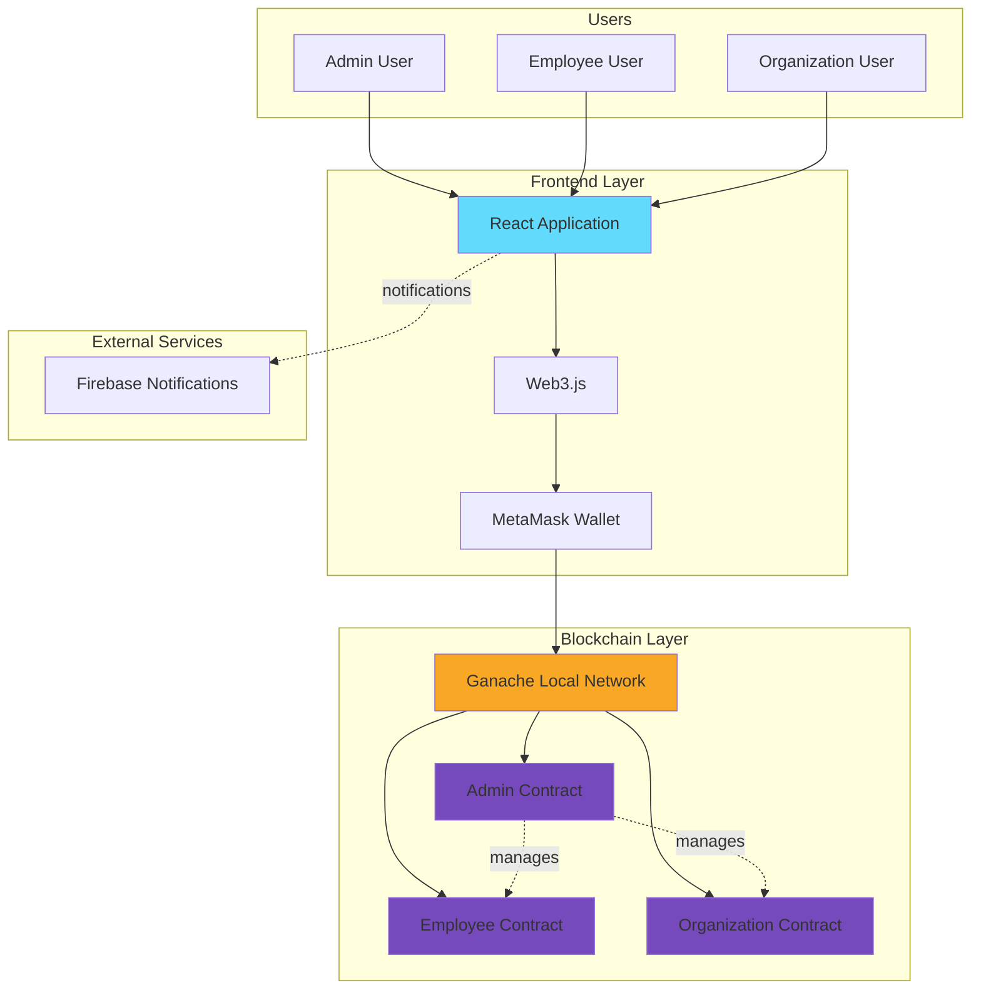
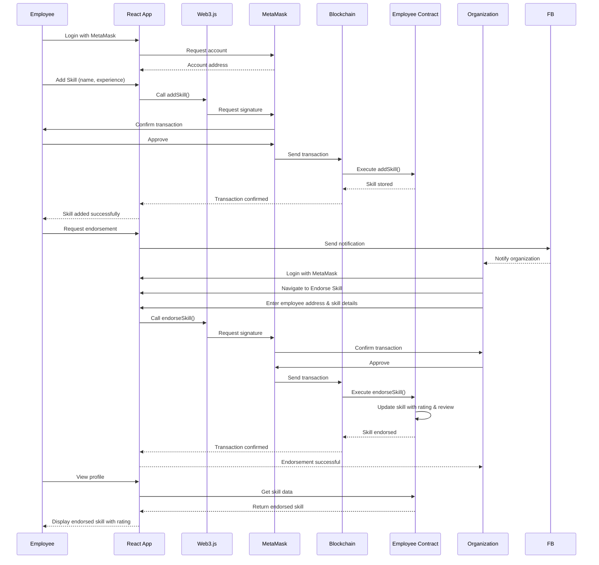
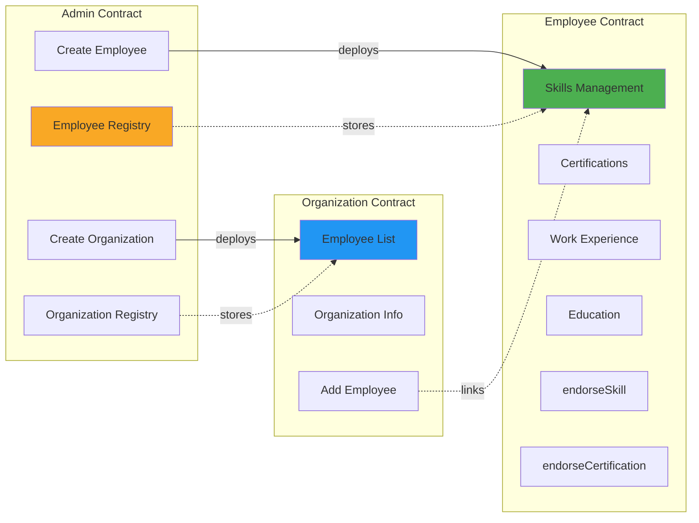
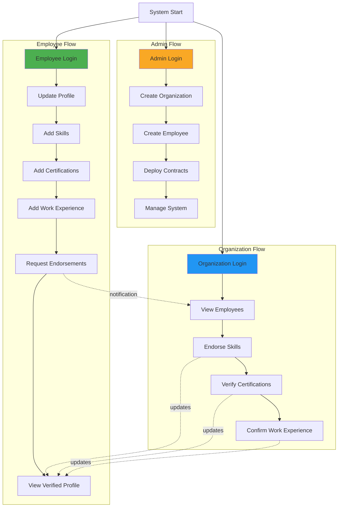
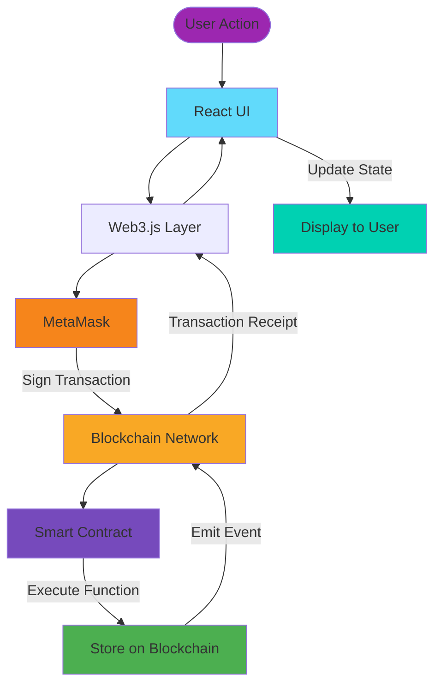

# Academic Verification System - Diagrams

## 1. System Architecture

## 2. Skill Endorsement Workflow

## 3. Smart Contract Architecture

## 4. User Journey Map

## 5. Data Flow Diagram

---

## How to Use These Diagrams

### For PowerPoint:
1. Copy the Mermaid code
2. Use [Mermaid Live Editor](https://mermaid.live) to render
3. Export as PNG/SVG
4. Insert into your presentation

### For Markdown Documents:
- These diagrams will render automatically in GitHub, VS Code (with Mermaid extension), or any Markdown viewer that supports Mermaid

### For Documentation:
- Keep this file in your project repository
- Reference in your README or technical documentation

---

## Diagram Descriptions

**System Architecture**: Shows the complete tech stack and how components interact

**Skill Endorsement Workflow**: Detailed sequence of events when endorsing a skill

**Smart Contract Architecture**: Relationships between the three main contracts

**User Journey Map**: Different user flows for Admin, Employee, and Organization

**Data Flow Diagram**: How data moves through the system from user action to blockchain storage
